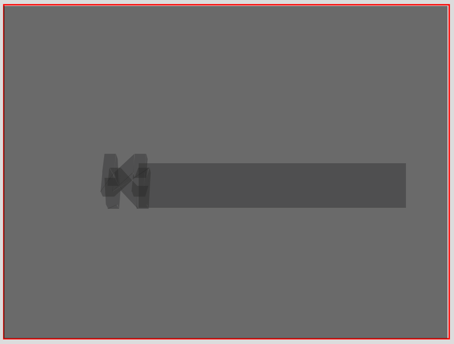

# Spark

A Nintendo 64 emulator written in modern C++.

This is an educational project.  
The goal is to implement an emulator capable of playing retail games at full speed.

## Current Status

Able to boot into the beginning of a game. Outputs vertices but no graphics backend implemented yet.

e.g. triangles for the first frame of Ocarina of Time, rendered with matplotlib:

## Building

Requirements:
- Linux
- GCC 16
- CMake 4
- Ninja

This project requires GCC 16 as it uses modules, contracts and reflection (C++26).  
Some or all of these features are not yet available in Clang/MSVC.