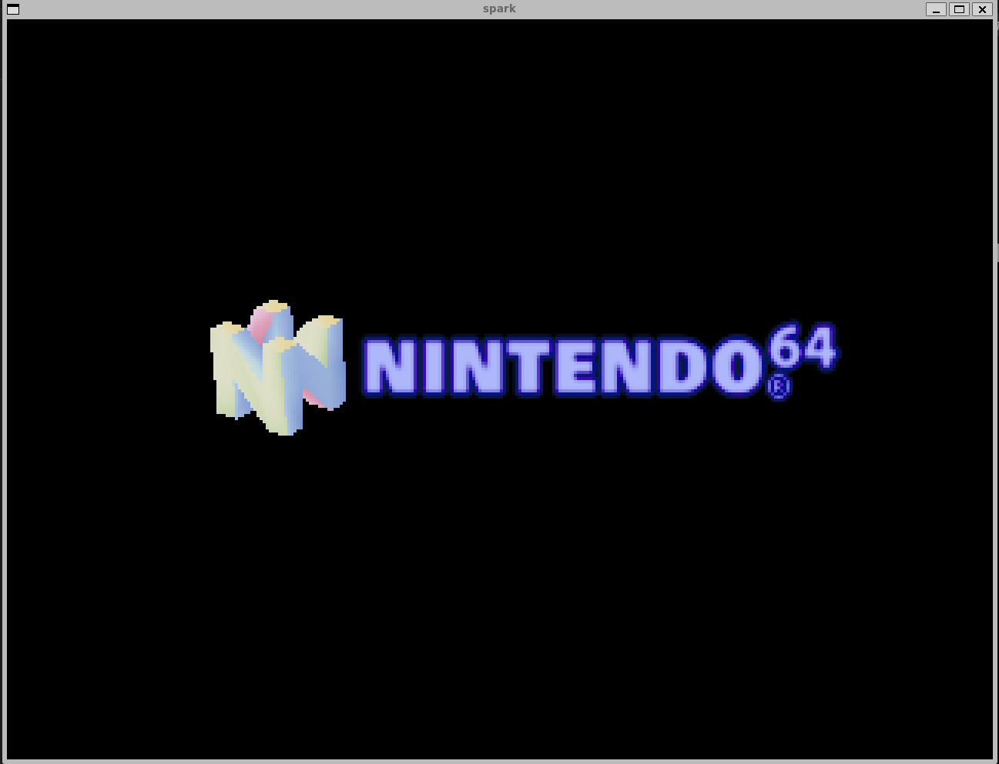
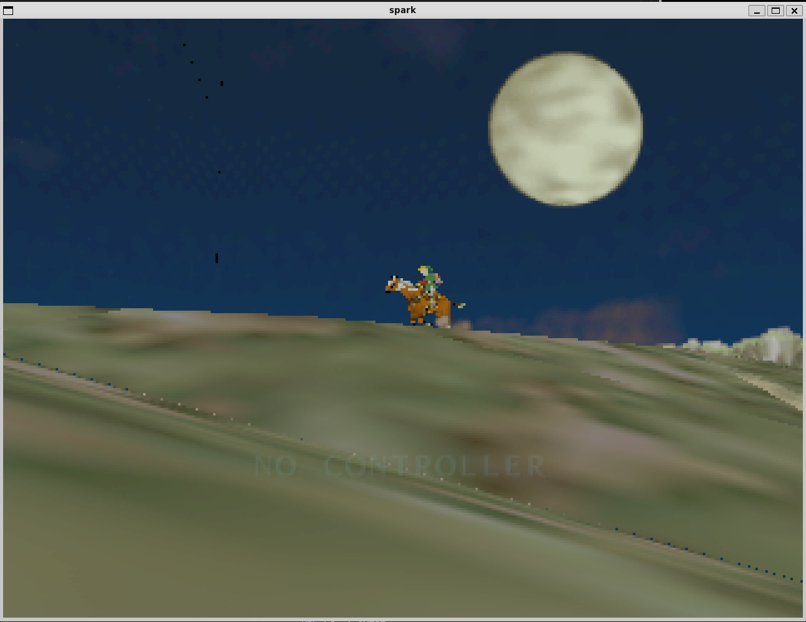
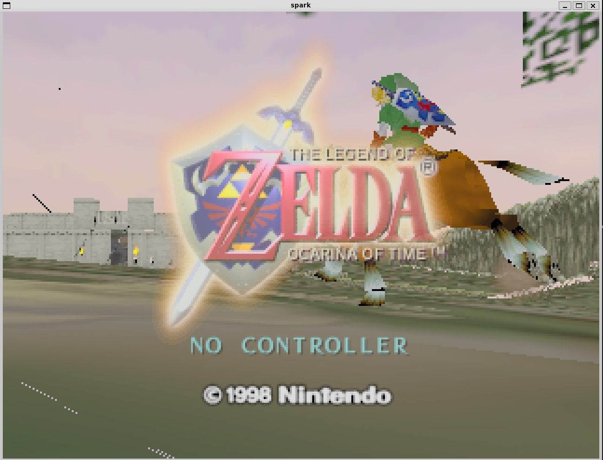

# Spark

A Nintendo 64 emulator written in modern C++.

This is an educational project.  
The goal is to eventually implement an emulator capable of playing retail games at full speed with reasonable visual accuracy.

## Current Status

Able to boot into a game and perform basic rendering with Vulkan.

## Building

This project requires the gcc-16 compiler as it uses modules, contracts and reflection (C++26).  
Some or all of these features are not yet available in Clang/MSVC.

Vulkan 1.4 is required.

### Ubuntu
Install from apt:
- gcc-16
- cmake=4.2.3
- ninja-build
- libvulkan-dev
- vulkan-tools
- vulkan-validationlayers
- glslc
- qt6-base-dev
- qt6-wayland

### Windows
Install MSYS2 with these packages:
- gcc (`mingw-w64-ucrt-x86_64-gcc`)
- CMake (`mingw-w64-ucrt-x86_64-cmake`)
- Ninja (`mingw-w64-ucrt-x86_64-ninja-1.13.2-1`)
- Vulkan SDK (`mingw-w64-ucrt-x86_64-vulkan-utility-libraries`)
- shaderc (`mingw-w64-ucrt-x86_64-shaderc`)
- Qt6 (`mingw-w64-ucrt-x86_64-qt6-tools`)